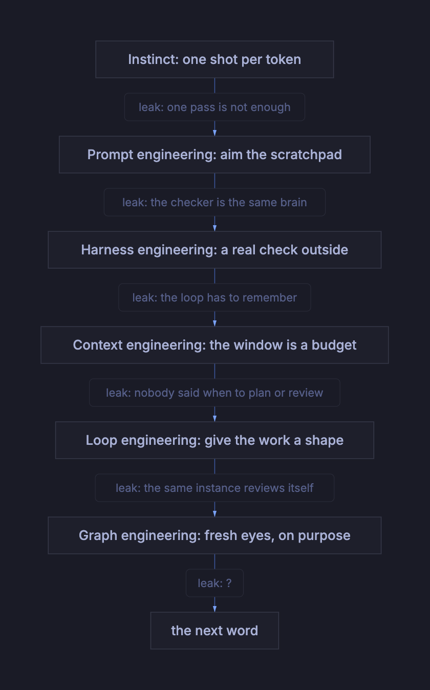
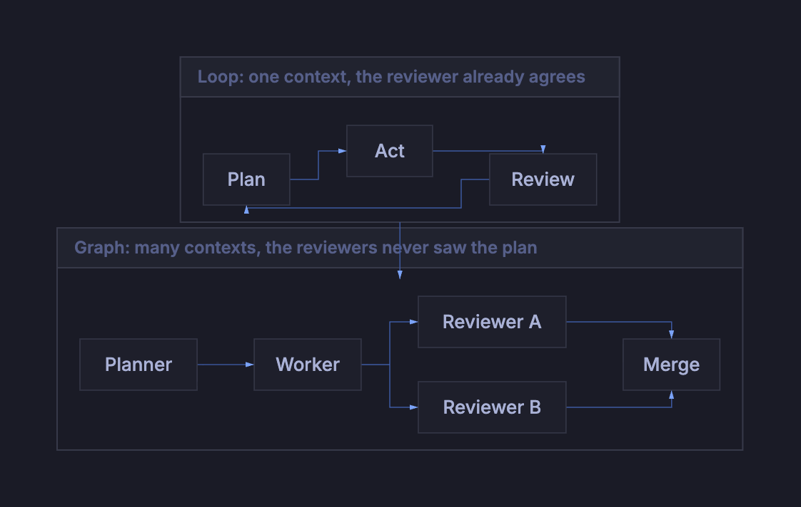

# Prompt, harness, context, loop, graph: the jargon is a changelog

Prompt engineering. Harness engineering. Context engineering. Loop engineering.
Graph engineering. Five techniques in about three years, all for getting more
out of the same box.

The usual reaction is that this is hype inventing vocabulary faster than it
invents substance. I think it is the opposite. Each of those words marks the
exact spot where the layer below it started leaking. Read them in order and you
are not reading a marketing deck, you are reading a changelog of everything we
found broken.

There is one line running through all five. **Every new term moves control one
step further out of the model.**

## Layer zero: it only has instincts

All five techniques rest on one fact about the base layer: it predicts the next
token, and that is the whole of it. Not a lookup, not a procedure.

If you want that argued properly, Steven Chen's [How AI actually
thinks](https://stevenc81.github.io/posts/how-ai-actually-thinks/) is the best
version I have read, and I am not going to re-run it here. Go and read it. I
want one detail out of the research it sent me to, because it is the thing that
changed how I build.

Anthropic
[traced Claude 3.5 Haiku doing addition](https://transformer-circuits.pub/2025/attribution-graphs/index.html)
and found the ones digit handled by a feature that means "something ending in 6
plus something ending in 9 ends in 5". That same feature fires on academic
citations, where a journal's volume number ends in 6 and its founding year ends
in 9, so the publication year has to end in 5. Suppress it and the citation
prediction moves. Swap it for `_9 + _9` and 1995 becomes 1998.

Read that again. It is not an arithmetic module getting called. It is a path
that runs through arithmetic on its way somewhere else, and something completely
unrelated to arithmetic can walk down it. There is no procedure in there to hold
onto. It is terrain.

Terrain has two properties that set up everything after. Instinct gets one shot
per token. And the weights are frozen while you work, so nothing figured out in
one session is there in the next.

Which fixes the job permanently, for me and for anyone building on this: get the
right information in front of it before it guesses, so the guess lands on a good
path instead of a popular one.

The five techniques are five answers to that one question.

## Prompt engineering: aim the scratchpad

The first fix for one-shot instinct was letting the model write before it
answers. A scratchpad is working memory, and it is also compute, because every
token written is one more pass through the machine. Merrill and Sabharwal put a
floor under that intuition: intermediate generation
[genuinely extends what a transformer can compute](https://arxiv.org/abs/2310.07923).
Their actual result is more interesting than the slogan, though. The amount is
what matters. A logarithmic number of steps barely lifts the ceiling; a linear
number buys a real new class of problems; a polynomial number lands you at
exactly the polynomial-time-solvable ones. Not *whether* it writes. How much.

But a scratchpad is a blank page, and blank pages get filled with whatever is
most familiar. Prompt engineering was us learning to aim it. "Think step by
step." "You are a senior security reviewer." The personas felt silly and worked
anyway, for an unglamorous reason: naming a role pulls the prediction onto the
paths where that role's writing lives. You are not motivating anyone. You are
picking a neighbourhood in the training data.

Then the model learned to check its own work. DeepSeek's
[R1-Zero](https://arxiv.org/abs/2501.12948) is the cleanest
demonstration I know of: they skipped the supervised fine-tuning stage entirely,
gave it no human reasoning traces to imitate, and paid reward only on whether
the final answer was right, nothing about how it got there. Nobody wrote a rule
about doubting yourself. It appeared anyway. The paper marks the moment by a
sudden spike in the word "wait", alongside responses that kept getting longer
from nothing but the training itself. AIME accuracy went from 15.6% on the base
model to 77.9% on R1-Zero (and 79.8% on R1).

Huge result. Also the end of the road for this layer, because the thing doing
the checking is the thing that made the mistake, running on the same worn paths
that produced it. An error shaped like a correct answer gets waved through,
because it looks right to precisely the instinct that generated it.

**The leak:** everything so far, self-doubt included, is instinct. There is no
guarantee anywhere in it.

## Harness engineering: put the loop outside

A guarantee has to come from something that cannot be talked round. A compiler
accepts the file or rejects it, and it does not care how confident the model
sounded. That is narrower than it first looks: a passing test proves the test
passed, nothing more. Narrow and real still beats broad and statistical.

So we wrapped the model in a program that runs it in a loop, hands it tools,
reads the results, and feeds them back. That program is the **harness**, and it
is the reason [the same model performs differently in different
products](https://parallel.ai/articles/what-is-an-agent-harness). Claude Code
and a chat window are the same weights with wildly different harnesses.

This is the first term where the engineering is not about words at all. It is
ordinary software: tool schemas, retries, permissions, what happens on failure.

**The leak:** a loop needs to remember. Turn twenty needs turn three, and the
window is finite.

## Context engineering: the window is a budget

So the harness takes over memory. What gets loaded, what gets summarised, what
gets dropped, what gets fetched only when needed. Karpathy's
[definition](https://x.com/karpathy/status/1937902205765607626) is the one
everyone quotes, describing
context engineering as the delicate art of filling the context window with just
the right information for the next step. Anthropic's
[write-up](https://www.anthropic.com/engineering/effective-context-engineering-for-ai-agents)
puts the sharp point on it: context is a **finite resource with diminishing
returns**.

That reframing is the whole discipline. Not "write a better prompt" but "spend a
budget." Dumping everything in is not thoroughness, it is noise, and noise moves
the prediction onto worse paths. Once you see the window as a budget, every
memory file, every retrieval call, every compaction step, every dynamically
loaded tool schema, and every cached prefix is a line item you can argue about.

**The leak:** the harness now has good memory and good tools, and still nothing
tells it *when* to plan, act and review.

## Loop engineering: give the work a shape

Plan, act, review, repeat. Nobody invented that for AI. It is how every
half-decent team already works. What changed is that it became a thing you
*write down* and enforce rather than hope for.

Concretely: a plan the agent has to produce before touching anything, gates it
has to pass to move on, a fixed number of retries before it stops and asks a
human. Anthropic's [building effective
agents](https://www.anthropic.com/engineering/building-effective-agents) draws
the useful line here. A **workflow** is code deciding the steps, an **agent** is
the model deciding them. Loop engineering is setting that dial per step, and
mostly discovering you wanted code in more places than you expected.

**The leak:** every step of that loop runs in the same instance, on the same
context, with the same cache. The reviewer already read the plan. It is not
reviewing, it is agreeing with itself in a different font.

## Graph engineering: fresh eyes, on purpose

The fix is embarrassingly simple once you have been bitten: hand the review to
somebody who was not in the room.

A fresh instance with a clean context and a narrow brief catches what the
author-instance structurally cannot, because it never built the attachment. Then
the same logic spreads through the rest of the loop. A researcher, a writer, a
critic, three of them in parallel with different lenses, and you are no longer
running a loop. You are running a **topology**. Who does what, what each one
sees, where the results merge. That is the graph.

Anthropic reported a lead-plus-subagents setup beating single-agent Claude Opus 4
by [90.2% on their internal research
eval](https://www.anthropic.com/engineering/multi-agent-research-system), and
were honest about the bill: multi-agent runs used roughly 15× the tokens of a
chat, and most coding work has fewer genuinely parallel parts than research does.
Fresh eyes are not free, and they are not always the answer.

Of the five, this is the term I would bet is least settled. "Graph" today covers
DAG frameworks, subagent fan-out, and orchestrator-worker patterns that are not
really graphs. The idea underneath it is stable, though: **isolated context is a
feature, not an inefficiency.**

## I built this before I had the words

My [content generation harness](/writings/content-generation-harness/) has all
five in it, and I named none of them at the time.

It runs on Claude Code, so the harness layer is borrowed. On top of it: audio is
generated first, and its word-level timestamps become the source of truth every
later stage reads. That is context engineering. I just called it "not letting
the animation lie about the narration." Almost every stage ends in a scored gate
and nothing advances until it passes, three failures and it stops and asks me.
Loop engineering. Script review runs six personas in parallel, each a separate
agent with its own brief: a beginner, a senior engineer, an editor, a tech
reviewer, a retention analyst, a competitor. The average has to clear 9/10 with
nothing below 8, and anything two personas flag independently is blocking.

That last one was graph engineering, and I built it for exactly the reason above.
One reviewer holding the full context kept telling me the script was great.

The words arrived later. They were still worth having, because a named pattern is
one you can compare notes on.

## Where the stack stops

Every one of these five techniques assumes a grader somewhere. Prompt engineering
needs you to know a good answer when you see it. Harness engineering needs a
compiler. Loop engineering needs a gate that can score. Graph engineering needs
the fresh reviewer to be judging against something. Take the grader away and the
whole stack has nothing to converge on, and keeps running anyway.

That is the honest limit. Where I want to go further is the two places I watch
people extrapolate from benchmarks that were graded to work that never will be.

**The physical world.** Nothing in this stack has felt anything. The model has
read a great deal about friction and lifted nothing. This is [Moravec's
paradox](https://en.wikipedia.org/wiki/Moravec%27s_paradox) with new hardware:
the reasoning we find hard is cheap, the sensorimotor competence a toddler has is
expensive. Serious work is going into world models and embodied learning and it
may well crack. But a model that clears an olympiad is not therefore close to
loading a dishwasher, and reading the first as evidence of the second is the most
common mistake in the discourse right now.

**Taste.** This one makes people angry, so let me be careful. AI genuinely
accelerates content: drafts, variants, decent visuals, in seconds. What it does
not have is judgement about which of them is worth publishing.

Austin Kleon's *Steal Like an Artist* is the honest description of what artists
actually do: absorb what came before, then recombine it through your own
perspective until it reads as new. That is not far off what the model does
mechanically. The difference is where the filter comes from. A veteran and an
amateur can steal from the same sources; what separates the output is years of
watching things land and fail, until "this one, not that one" costs no thought at
all. That filter is built from consequences, and the model has experienced none.
It has read every review ever written and been in the room for zero of them.

Which is the no-grader problem again, wearing a beret. A marketing campaign does
not compile.

## The changelog

So: prompt engineering aimed the scratchpad, harness engineering put a real check
outside the model, context engineering made memory a budget, loop engineering
gave the work a shape, graph engineering broke the shared context so that review
means something again.

Five words, five leaks, control moving one step further out each time. When the
sixth shows up, and it will (my bet is **verification engineering** or **spec
engineering**, because multi-agent fan-out just shifted the bottleneck onto
human review), the useful question is not whether it is hype. It is: *which
layer just failed?*

One last thing, and it is the part that makes me optimistic rather than tired.
None of these five arrived out of the box. Every one started as people working
around something the model would not do on its own, and every one has since been
absorbed by the tools.

Writing "think step by step" by hand became a thinking mode you toggle. Keeping
notes files because the thing forgot became memory and automatic compaction.
Opening a second chat window for an unbiased read became subagents. The harness
itself stopped being something you wrote and became something you install.

Loop engineering is the clearest case, because it happened most recently. People
were wiring plan-act-review cycles together in shell scripts and cron jobs for a
year. Claude Code now ships `/loop`, which will run a prompt on an interval or
let the model pace itself. The thing I was gluing together by hand is a slash
command.

So the pattern is not just five leaks and five patches. It is a cycle: we hack
around a limit, the hack becomes a named practice, the practice becomes a
default, and the next limit surfaces one layer up wearing a new word. Every term
here is a workaround that got promoted.

Which makes the interesting question a forward-looking one. Whatever we are
currently doing by hand, awkwardly, with too many moving parts, is probably the
next thing to become a checkbox. I am curious to see which of my duct tape the
next model update makes redundant.

The jargon is annoying. It is also the most honest documentation the field has.
